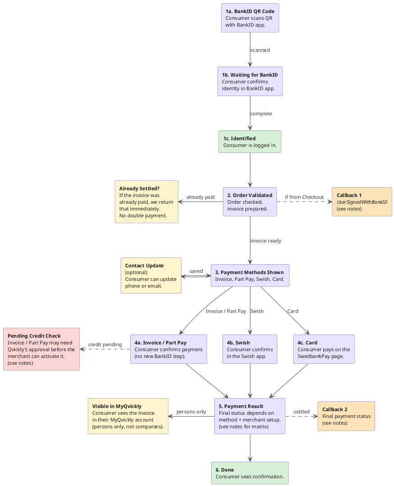

# Pay With Qvickly Flow

Pay With Qvickly is one of the payment options a consumer can pick inside the Qvickly Checkout on a merchant's site. Picking it opens the MyQvickly payment page in a popup, where the consumer confirms who they are with BankID and finishes the payment by invoice, part payment, Swish, or card. The final outcome is returned to the checkout, and to the merchant if they have a callback configured.

The diagram below walks through each step.



## Notes

### Step 5: Payment Result statuses

The status returned depends on the chosen method and the **autoactivate** setting on the checkout session. Autoactivate decides whether an approved payment is marked as completed immediately, or held as `Created` until the merchant activates it manually.

| Method | Autoactivate | Credit check | Status |
|---|---|---|---|
| Swish | n/a | n/a | `Paid` |
| Card | on | n/a | `Paid` |
| Card | off | n/a | `Created` (held) |
| Invoice | on | approved | `Factoring` |
| Invoice | on | pending | `Pending` |
| Invoice | off | n/a | `Created` |
| Part Pay | on | approved | `Partpayment` |
| Part Pay | on | pending | `Pending` |
| Part Pay | off | n/a | `Created` |

### Pending Credit Check

For Invoice and Part Pay, a credit check can return `Pending` regardless of the autoactivate setting. The order's status becomes `Pending` and the merchant cannot activate it until Qvickly approves it.

### Visible in MyQvickly

MyQvickly is for persons only, not companies. Within MyQvickly:

- **Pågående** (ongoing): `Created`, `Pending`. No actions available yet.
- **Genomförda** (completed): `Paid`, `Factoring`, `Handling`, `Partpayment`. Full actions available (extend, return, pay with Swish).

### Callback #1: `UserSignedWithBankID`

This callback fires after BankID authentication, **not** after payment. The consumer is still on the payment-method-selection screen. Treat it as a "consumer arrived at the payment step," not as a confirmation.

To receive it, the merchant must have `callbackurl` set on the order. It then fires when **all** of these are true:

- A new invoice was just created (not a returning visit)
- The merchant has `callbackurl` configured

Payload:

```json
{
  "number": "1088",
  "status": "UserSignedWithBankID",
  "orderid": "134639567929",
  "url": "https://invoice.qvickly.io/..."
}
```

| Field | Meaning |
|---|---|
| `number` | Qvickly's invoice number for this order. |
| `status` | Always `UserSignedWithBankID` for this callback. |
| `orderid` | The merchant's own order reference, the same value the merchant sent when creating the order. |
| `url` | Link to the invoice in Qvickly. The merchant can show it to staff or attach it in their own system. |

The callback is not re-sent on returning visits.

### Callback #2: Final settlement status

This is the standard post-payment callback. It fires after the consumer completes payment inside the PWQ popup.

The payload uses the same `orderid` and `number` as Callback #1 but with the final `status` (`Paid`, `Created`, `Pending`, `Factoring`, `Partpayment`, etc.) matching the Step 5 matrix.

Callback #2 also fires for the other Qvickly Checkout payment methods, not just PWQ.

### Order method 2048

Internally, PWQ orders are identified by method `2048`. Step 2 rejects anything that isn't a method-2048 order. This is mostly relevant for integrators inspecting the API payload.
