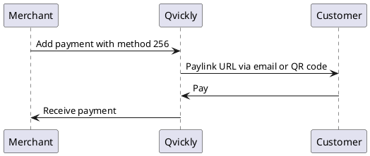
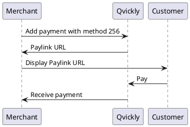
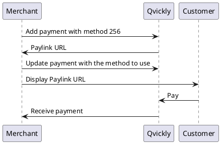

# Paylink Flow

<include from="Snippets-PaylinkAPI.md" element-id="snippet-header" />

## Paylink Flow using Qvickly Portal

## Paylink Flow using API

### Normal Flow

### Specify payment method

