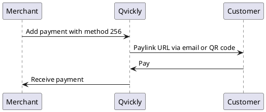

# Paylink Flow

```plantuml

@startuml

participant "Merchant" as M
participant "Qvickly" as Q
participant "Customer" as C

M->Q: Add payment with method 256
Q->C: Paylink URL via email or QR code
C->Q: Pay
Q->M: Receive payment

@enduml

```