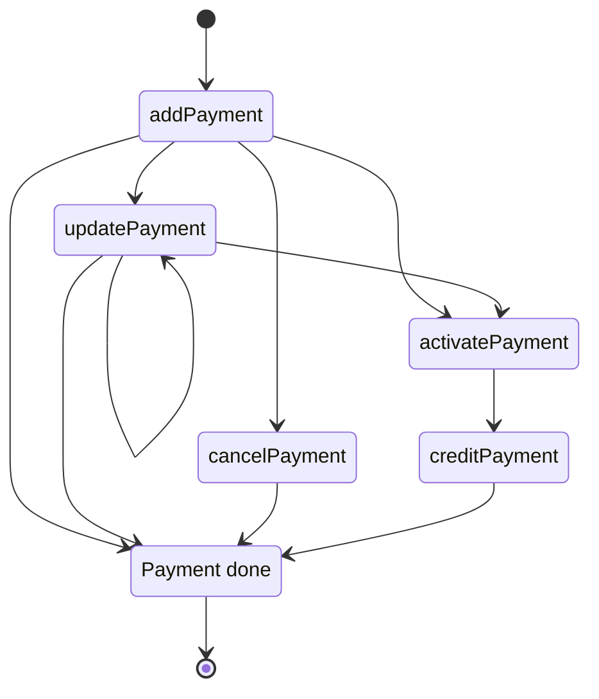

# Payment API

<include from="Snippets-PaymentAPI.md" element-id="snippet-header"></include>

The Payment API is the base for many of the Qvickly services. It is used to create and manage payments, and to get information about payments.

> The latest version of the Payment API is %API_VERSION%

Here is a simple state diagram for addPayment and where to go from there:
