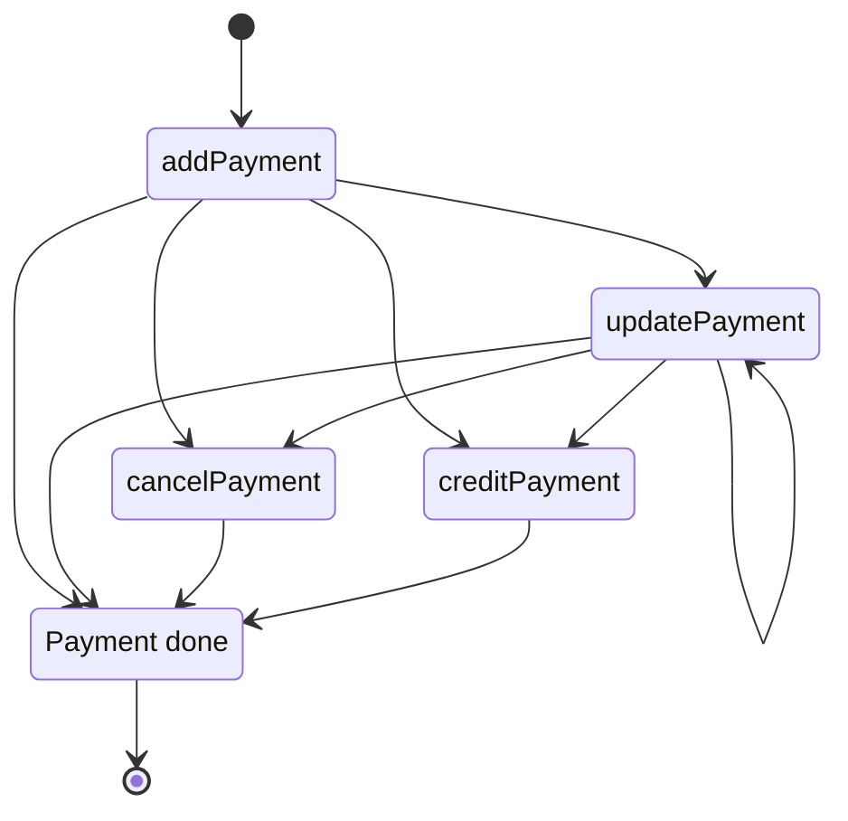

# Payment API

<include from="Snippets-WorkingInformation.md" element-id="snippet-finalizing" />

The Payment API is the base for many of the Qvickly services. It is used to create and manage payments, and to get information about payments.

> The latest version of the Payment API is %API_VERSION%

Here is a list of the most common methods used with addPayment in the Payment API:
```Mermaid
graph LR
    A[addPayment] -->|Method 1| B[Factoring invoice]
    A -->|Method 2| C[Handling invoice]
    A -->|Method 4| D[Part payment]
    A -->|Method 8| E[Card payment]
    A -->|Method 16| F[Bank payment]
    A -->|Method 64| G[Checkout]
    A -->|Method 256| H[Paylink]
    A -->|Method 512| I[Swish]
    A -->|Method 1024| J[Swish]
    A -->|Method 2048| K[MyQvickly]
    G -->|Method 8| E[Card payment]
    G -->|Method 2048| K[MyQvickly]
    H -->|Method 1| B[Factoring invoice]
    H -->|Method 4| D[Part payment]
    H -->|Method 8| E[Card payment]
    H -->|Method 16| F[Bank payment]
    H -->|Method 512| I[Swish]
    H -->|Method 1024| J[Swish]
    K -->|Method 1| B[Factoring invoice]
    K -->|Method 4| D[Part payment]
    K -->|Method 8| E[Card payment]
    K -->|Method 16| F[Bank payment]
    K -->|Method 512| I[Swish]    
    K -->|Method 1024| J[Swish]
```

And here is a state diagram for addPayment and where to go from there:
